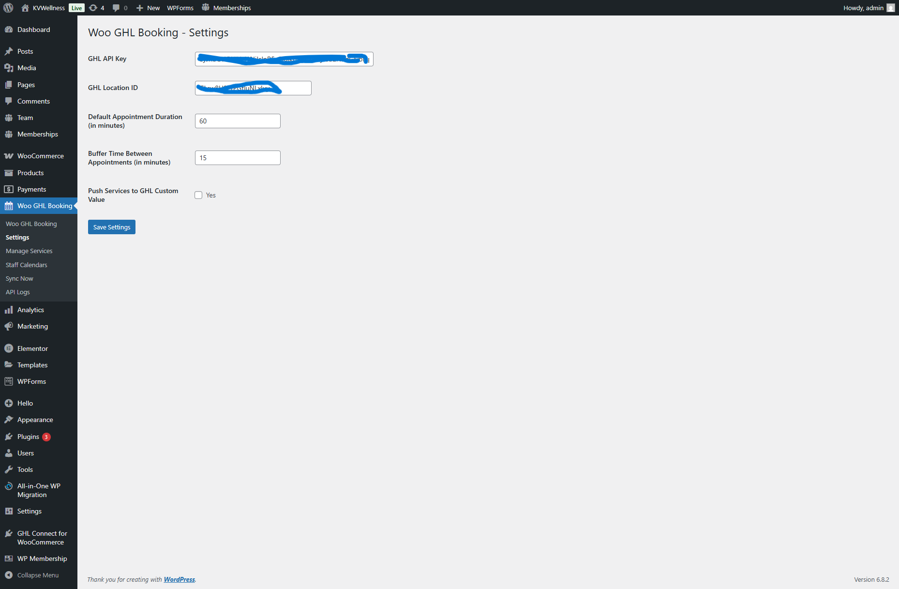
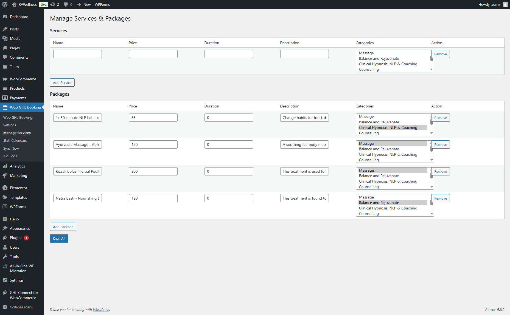

# 🚀 WooCommerce GHL Booking System Plugin

A powerful custom WordPress plugin that integrates **WooCommerce appointment bookings** with **GoHighLevel (GHL)** CRM and **Google Calendar**, enabling seamless service scheduling, staff selection, and automated customer sync.

---

## 📌 Overview

This plugin transforms WooCommerce into a **complete booking system**, allowing users to select services, staff, and time slots while automatically syncing booking data to GoHighLevel.

Built for businesses like:

* Salons & Spas
* Clinics
* Service-based businesses
* Appointment-driven workflows

---

## ✨ Key Features

### 🗓️ Appointment Booking System

* Select **service, staff, date & time**
* Real-time booking flow integrated with WooCommerce checkout

### 👨‍💼 Staff & Service Management

* Dynamic service selection
* Staff assignment per service
* Optional integration with GHL for fetching data

### 🔄 GoHighLevel (GHL) Integration

* Automatically creates/updates **contacts in GHL**
* Sends booking details:

  * Name, Email, Phone
  * Service, Staff
  * Date & Time
* Supports custom values sync

### 📅 Google Calendar Sync

* Automatically adds bookings to shared calendar
* Keeps track of appointments centrally

### 💰 WooCommerce Integration

* Uses standard WooCommerce checkout
* Booking data stored in order meta
* Fully compatible with payment gateways

### ⚡ Dynamic Booking UI

* Clean frontend selection UI
* Service grouping (packages & individual services)
* Real-time price updates

---

## 🛠️ Tech Stack

* **WordPress (PHP)**
* **WooCommerce**
* **GoHighLevel API**
* **JavaScript / jQuery**
* **MySQL**

---

## 📂 Project Structure

```bash
plugin/
├── admin/              # Admin settings & service management
├── includes/           # Core plugin logic
├── public/             # Frontend booking UI
├── assets/             # CSS, JS files
├── templates/          # Booking templates
├── main-plugin-file.php
```

---

## ⚙️ Installation

1. Upload plugin to `/wp-content/plugins/`
2. Activate plugin from WordPress admin
3. Configure settings:

   * GoHighLevel API Key
   * Services & Staff
   * Google Calendar (optional)
4. Assign plugin to WooCommerce product

---

## 🔧 Configuration

### GoHighLevel Setup

* Add API Key in plugin settings
* Map custom fields if needed

### Services & Staff

* Add services via admin panel
* Assign staff per service

### Booking Flow

* User selects:

  * Service → Staff → Date → Time
* Proceeds to checkout
* Booking saved + synced

---

## 📸 Screenshots

*(Add screenshots here for better impact)*

* Booking form UI
* Service selection
* WooCommerce checkout
* Admin panel

---

## 🚀 Use Cases

* Appointment booking systems
* CRM-integrated service platforms
* Automated lead capture + scheduling
* WooCommerce-based SaaS tools

---

## ⚠️ Notes

* `.env`, `node_modules`, and sensitive configs are excluded
* This repository contains **source code only (no build files)**

---

## 📢 Attribution

This project was initially inspired by an open-source approach.
Significant modifications and custom development have been implemented.

---

## 👨‍💻 Author

**Vishav Bandhu**
Full Stack Developer

* Node.js | PHP | WooCommerce | GHL Integration
* Open to Remote Opportunities

---

## ⭐ Support

If you find this project useful:

* Star ⭐ the repo
* Connect on LinkedIn
* Reach out for collaboration

---

## 📸 Screenshots

### 🖥️ Dashboard


---

### 📅 Services



----------

### 📅 Frontend services


This project was initially inspired by an open-source project.
Significant modifications and custom development have been implemented.
If you are the original author and want attribution, please contact me.
## License

This project is proprietary and is not open for public use, distribution, or modification without explicit permission from the author.

© Vishav Bandhu. All rights reserved.
For commercial usage or licensing inquiries, 
please contact: mr.kaith@gmail.com Website:https://www.itsbegin.in/
---------------
